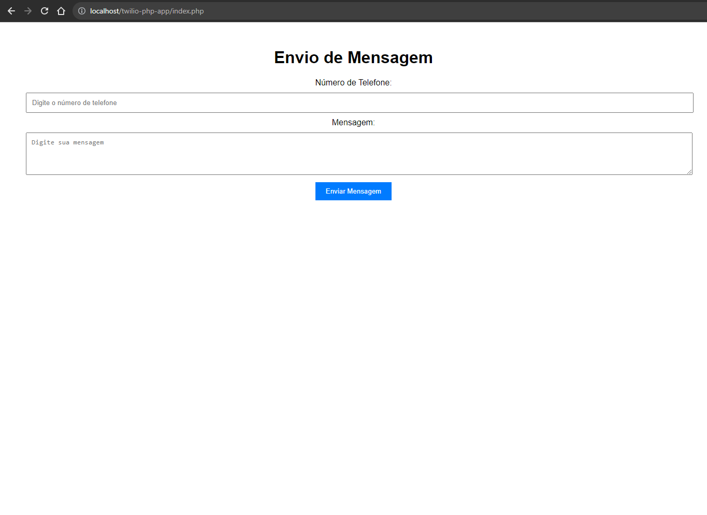

# Teste da API do Twilio com WhatsApp



Este repositório contém um projeto de teste da API do Twilio para integração com o WhatsApp. É um exemplo simples de como usar o Twilio para enviar mensagens pelo WhatsApp.

## Instruções de Instalação

Para executar o teste, siga estas instruções:

1. Instale e configure o XAMPP.
2. Clone este repositório para a pasta C:\xampp\htdocs em seu computador.
3. Inicie o servidor Apache usando o XAMPP.
4. Acesse http://localhost/twilio-php-app/index.php em seu navegador.

:link: [Clique aqui para acessar](http://localhost/twilio-php-app/index.php)

## Configuração das Credenciais da Twilio

Para utilizar a integração com o WhatsApp usando o Twilio, é necessário configurar suas credenciais da Twilio. Siga estas etapas:

1. Crie um arquivo `config.php` na raiz do seu projeto.

2. Dentro do arquivo `config.php`, adicione o seguinte código, substituindo `'seu_sid'` e `'seu_token'` pelos valores reais do SID e token fornecidos pela Twilio:

```php
<?php
return [
    'sid' => 'seu_sid',
    'token' => 'seu_token'
];
?>
```

## Tecnologias Utilizadas

- HTML: Usado para criar a estrutura da página web.
- CSS: Responsável pelo estilo e aparência da página.
- PHP: Utilizado para interagir com a API do Twilio e enviar mensagens pelo WhatsApp.
- XAMPP: Ambiente de desenvolvimento que inclui o servidor Apache necessário para executar o projeto.
- Git e GitHub: Ferramentas de controle de versão para gerenciar o código-fonte do projeto.

## Contato

- E-mail: demoraes.antero@gmail.com